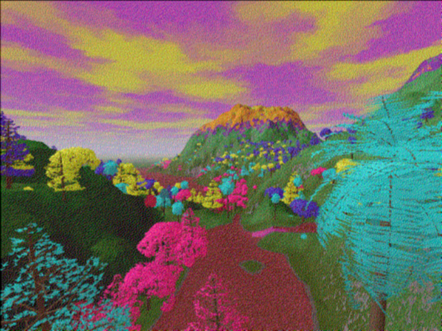
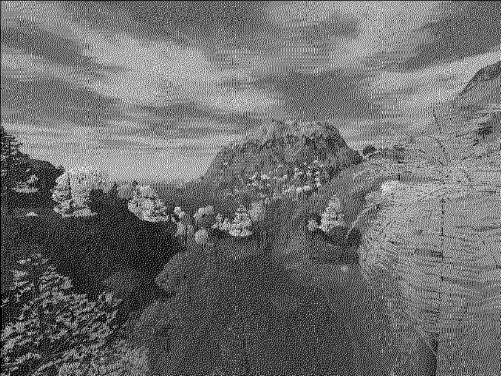
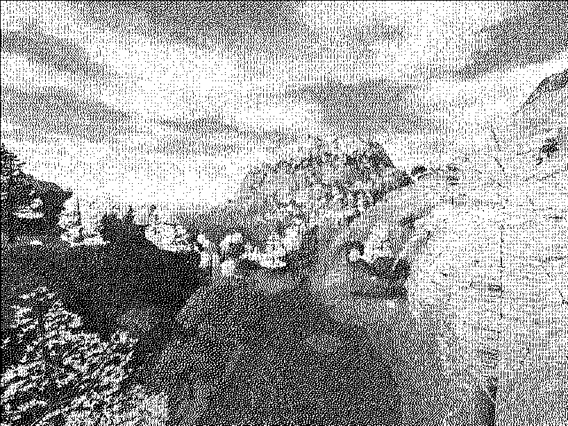
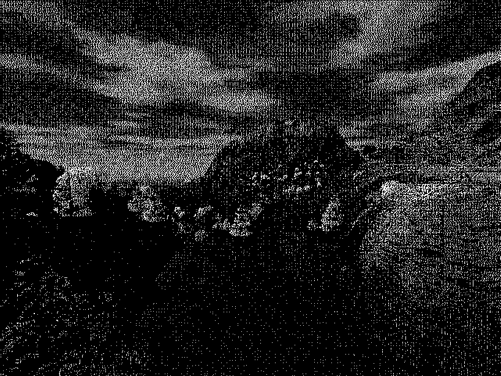
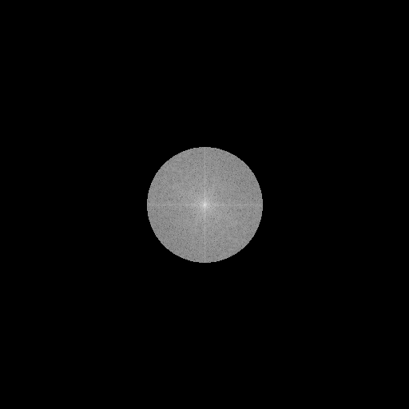
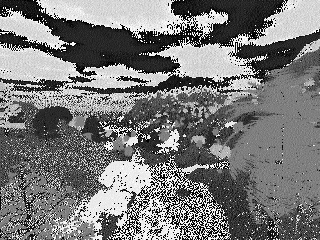
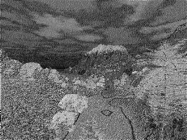
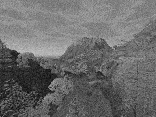
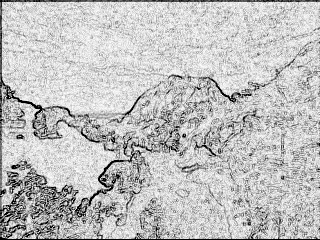

## Images Filters

In this project, we develop some algorithms to recreate image filters for BMP images.

You need to install QT:

    sudo apt install build-essential
    sudo apt install qtcreator

Example:

  | Step | Images |
  :-------------------------:|:-------------------------:
   ORIGINAL |  
   CONVOLUTION |  
   GRAY |  
   THRESHOLD 85 | 
   THRESHOLD 185 | 
   FOURIER  |  
   HSV R |  
   HSV G |  
   HSV B |  
   EDGE |  

