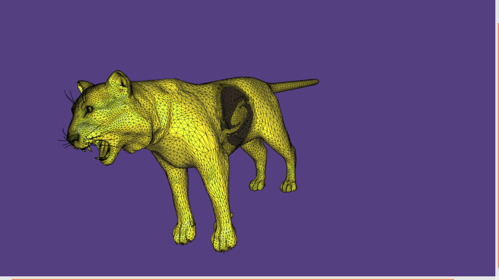

## Fast Winding Number Approximation

We try to reproduce the paper adjunt in this repository. To do this, we use IGL library.

We calculate winding numbers using library function and fast approximation algorithm.

  | Mesh | Complete | Windings |
  :-------------------------:|:-------------------------:
   SigCat  |   |  
   Bear    |   |  
   Bunny  |   |   
   Girl  |   |   
   Crocodile  |   |   

## Run the project

Go to the directory `fast-winding-number-soups` and check the Readm file to install all dependencies.

* Once installed all dependencies, just run the following command:

      ./compileFile

